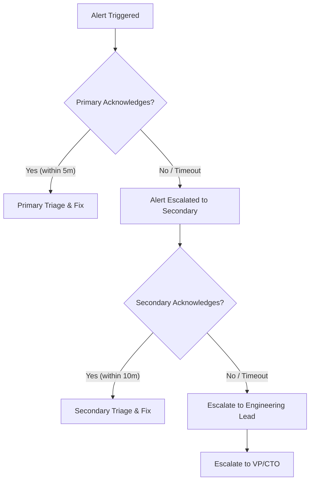

# Incident Response Runbook

This document details the incident response procedures, severity levels, escalation paths, and communication guidelines for the Restaurant Platform.

---

## 1. Severity Categories

When an incident occurs, use the following matrix to categorize severity:

| Severity Level | Definition | Target Response (MTTR) | Communication Frequency | Example Scenarios |
| :--- | :--- | :--- | :--- | :--- |
| **SEV 1 - Critical** | Core business functionality is entirely down. High financial or security impact. | **Ack:** < 5 mins<br>**Resolve:** < 2 hours | Every 15–30 mins | • Payment gateway down.<br>• Data breach / active exploit.<br>• Database cluster unresponsive.<br>• Core API offline globally. |
| **SEV 2 - Major** | Degraded performance or partial outage. Core workflows work but are slow/flaky. | **Ack:** < 15 mins<br>**Resolve:** < 4 hours | Every 1 hour | • Checkout fails for a subset of restaurants.<br>• Valkey/Redis cache down (falling back to DB).<br>• Delivery tracking maps failing to load.<br>• Latency spikes > 2s. |
| **SEV 3 - Minor** | Non-critical functionality is degraded or broken. Workarounds exist. | **Ack:** < 1 hour<br>**Resolve:** < 24 hours | Every 4 hours / daily | • Menu image uploads failing.<br>• Analytics dashboard load errors.<br>• Minor UI glitches in admin portal. |

---

## 2. Escalation Routing & On-Call Cycles

### On-Call Schedules

* **Rotation:** 12-hour shifts (08:00 - 20:00 and 20:00 - 08:00 Local Time), rotating weekly.
* **Primary On-Call:** First responder to automated alerts and manual escalations.
* **Secondary On-Call (Shadow):** Backup responder. Must acknowledge within 10 minutes if Primary is unresponsive.

### Escalation Path



### Escalation Contact List

| Role | Contact Channel | Escalation Delay (after no ack) |
| :--- | :--- | :--- |
| **Primary On-Call** | PagerDuty / Slack Alert | Immediate |
| **Secondary On-Call** | PagerDuty Call / Phone | 5 minutes |
| **Engineering Lead** | Phone / Slack Direct | 15 minutes |
| **VP of Engineering / CTO**| Phone Call | 30 minutes |

---

## 3. Communication Alerts & Templates

All official communications must use the designated channels:

* **Internal Chat:** `#incident-war-room` (Slack/Teams)
* **Customer Facing Status:** StatusPage.io (or equivalent)
* **Alerting Tool:** PagerDuty / Opsgenie

### Incident Update Templates

#### SEV 1 Initial Alert (Internal & Slack)

```text
🚨 SEV 1 INCIDENT ACTIVE 🚨
Incident ID: [INC-XXXX]
Description: [Brief Description, e.g., Checkout API responding with 500 errors]
Status: Investigating
Lead Responder: [Primary On-Call Name]
War Room Link: [Slack/Teams Channel or Video Link]
```

#### SEV 1 Customer-Facing Status Page (Initial)

```text
Investigating - We are currently experiencing an issue affecting checkout and payment processing. 
Our engineering team is actively investigating the root cause. 
Further updates will be posted here as they become available.
```

#### SEV 1 Customer-Facing Status Page (Update)

```text
Monitoring - We have identified the cause of the checkout failures and applied a mitigation. 
We are monitoring checkout success rates to ensure full stability is restored.
```

#### SEV 1 Customer-Facing Status Page (Resolution)

```text
Resolved - The issues affecting checkout and payment processing have been resolved. 
All systems are operating normally. We apologize for any inconvenience caused.
```
